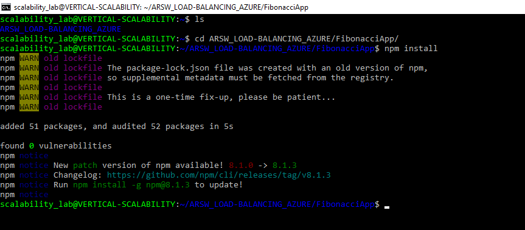
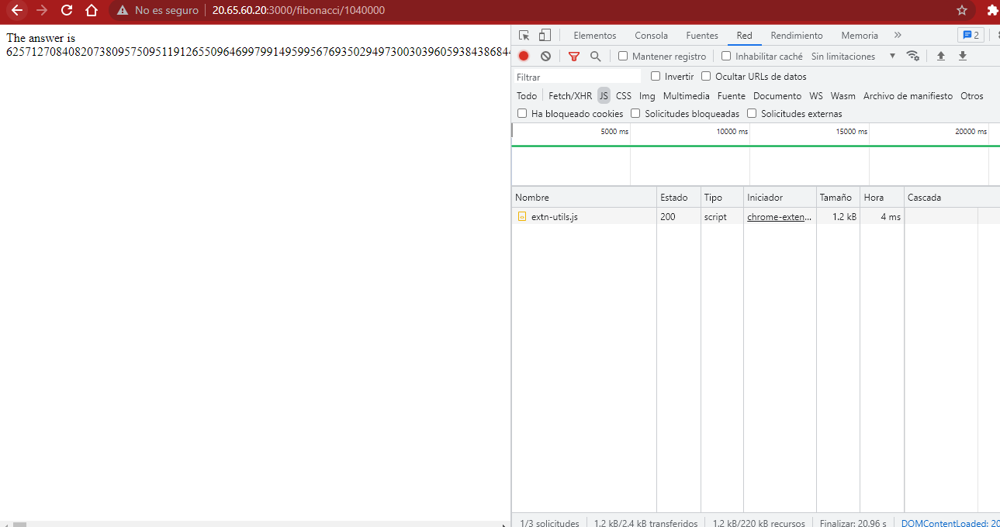
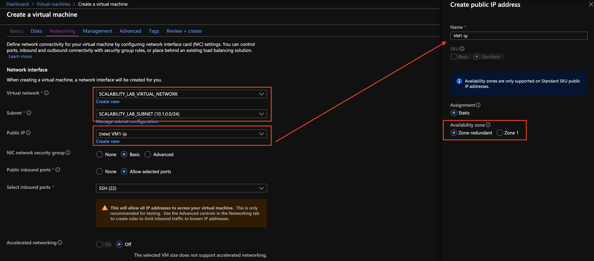
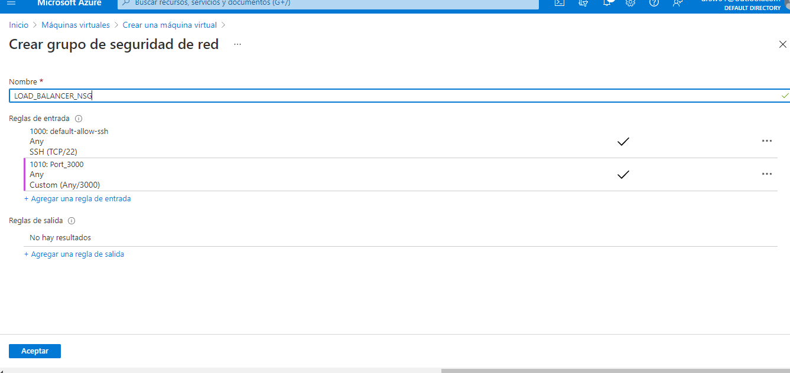

### Escuela Colombiana de Ingeniería
### Arquitecturas de Software - ARSW

## Escalamiento en Azure con Maquinas Virtuales, Sacale Sets y Service Plans

### Dependencias
* Cree una cuenta gratuita dentro de Azure. Para hacerlo puede guiarse de esta [documentación](https://azure.microsoft.com/en-us/free/search/?&ef_id=Cj0KCQiA2ITuBRDkARIsAMK9Q7MuvuTqIfK15LWfaM7bLL_QsBbC5XhJJezUbcfx-qAnfPjH568chTMaAkAsEALw_wcB:G:s&OCID=AID2000068_SEM_alOkB9ZE&MarinID=alOkB9ZE_368060503322_%2Bazure_b_c__79187603991_kwd-23159435208&lnkd=Google_Azure_Brand&dclid=CjgKEAiA2ITuBRDchty8lqPlzS4SJAC3x4k1mAxU7XNhWdOSESfffUnMNjLWcAIuikQnj3C4U8xRG_D_BwE). Al hacerlo usted contará con $200 USD para gastar durante 1 mes.

### Parte 0 - Entendiendo el escenario de calidad

Adjunto a este laboratorio usted podrá encontrar una aplicación totalmente desarrollada que tiene como objetivo calcular el enésimo valor de la secuencia de Fibonnaci.

**Escalabilidad**
Cuando un conjunto de usuarios consulta un enésimo número (superior a 1000000) de la secuencia de Fibonacci de forma concurrente y el sistema se encuentra bajo condiciones normales de operación, todas las peticiones deben ser respondidas y el consumo de CPU del sistema no puede superar el 70%.

### Parte 1 - Escalabilidad vertical

1. Diríjase a el [Portal de Azure](https://portal.azure.com/) y a continuación cree una maquina virtual con las características básicas descritas en la imágen 1 y que corresponden a las siguientes:
    * Resource Group = SCALABILITY_LAB
    * Virtual machine name = VERTICAL-SCALABILITY
    * Image = Ubuntu Server 
    * Size = Standard B1ls
    * Username = scalability_lab
    * SSH publi key = Su llave ssh publica


   * Nos dirigimos a creacón de mauina virtual y realizamos la creación con los parametros indicados
   
   
   
   
   
   
   
   
   
   

2. Para conectarse a la VM use el siguiente comando, donde las `x` las debe remplazar por la IP de su propia VM.

    `ssh scalability_lab@xxx.xxx.xxx.xxx`
    
    * En nuestra consola de la VM nos dirigimos a la opción conectarnos, en esta pestaña nos indica como realizar la conexión
    
    
    
    * Nos dirigimos al archivo en donde descargamos el las llaves pem y abrimos una terminal
    
    
    
    * En la terminal escribimos el comando que nos dan en azure reemplazando <ruta de acceso de clave privada> por el nombre de nuestra clave pem
   
    


3. Instale node, para ello siga la sección *Installing Node.js and npm using NVM* que encontrará en este [enlace](https://linuxize.com/post/how-to-install-node-js-on-ubuntu-18.04/).
   
4. Para instalar la aplicación adjunta al Laboratorio, suba la carpeta `FibonacciApp` a un repositorio al cual tenga acceso y ejecute estos comandos dentro de la VM:

    `git clone <your_repo>`
   
    

    `cd <your_repo>/FibonacciApp`

    `npm install`
   
    
   

5. Para ejecutar la aplicación puede usar el comando `npm FibinacciApp.js`, sin embargo una vez pierda la conexión ssh la aplicación dejará de funcionar. Para evitar ese compartamiento usaremos *forever*. Ejecute los siguientes comando dentro de la VM.

    `npm install forever -g`

    `forever start FibinacciApp.js`

6. Antes de verificar si el endpoint funciona, en Azure vaya a la sección de *Networking* y cree una *Inbound port rule* tal como se muestra en la imágen. Para verificar que la aplicación funciona, use un browser y user el endpoint `http://xxx.xxx.xxx.xxx:3000/fibonacci/6`. La respuesta debe ser `The answer is 8`.


   
   
   
   Inciamos node
   
   
   
   Consultamos la ruta http://20.65.60.20:3000/fibonacci/8
   
   
   
   Y podemos observar que lo recibio 
   
   

7. La función que calcula en enésimo número de la secuencia de Fibonacci está muy mal construido y consume bastante CPU para obtener la respuesta. Usando la consola del Browser documente los tiempos de respuesta para dicho endpoint usando los siguintes valores:
   
    * 1000000
      
      Tarda 21.70s
   
      
   
    * 1010000
   
      Tarda 22.16s
   
      
   
    * 1020000
  
      Tarda 22.24s
   
      
      
    * 1030000
   
      Tarda 23.57s
   
      
   
    * 1040000
   
      Tarda 24.20s
   
      
   
    * 1050000
   
      Tarda 24.91s
   
      
   
    * 1060000
   
      Tarda 25.23s
   
      
   
    * 1070000
   
      Tarda 25.71s
   
      
   
    * 1080000
   
      Tarda 25.75s
   
      
   
    * 1090000    
   
      Tarda 26.19s
   
      
   

8. Dírijase ahora a Azure y verifique el consumo de CPU para la VM. (Los resultados pueden tardar 5 minutos en aparecer).


   
   * Podemos observar que los consumos de CPU son supremamente altos y que cada pico es el fin del procesamieto de una de las secuencias de fibonacci
   
     
   
     

9. Ahora usaremos Postman para simular una carga concurrente a nuestro sistema. Siga estos pasos.
    * Instale newman con el comando `npm install newman -g`. Para conocer más de Newman consulte el siguiente [enlace](https://learning.getpostman.com/docs/postman/collection-runs/command-line-integration-with-newman/).
   
   
   
    * Diríjase hasta la ruta `FibonacciApp/postman` en una maquina diferente a la VM.
   
    * Para el archivo `[ARSW_LOAD-BALANCING_AZURE].postman_environment.json` cambie el valor del parámetro `VM1` para que coincida con la IP de su VM.
   
   
   
    * Ejecute el siguiente comando.

    ```
    newman run ARSW_LOAD-BALANCING_AZURE.postman_collection.json -e [ARSW_LOAD-BALANCING_AZURE].postman_environment.json -n 10 &
    newman run ARSW_LOAD-BALANCING_AZURE.postman_collection.json -e [ARSW_LOAD-BALANCING_AZURE].postman_environment.json -n 10
    ```
   
10. La cantidad de CPU consumida es bastante grande y un conjunto considerable de peticiones concurrentes pueden hacer fallar nuestro servicio. Para solucionarlo usaremos una estrategia de Escalamiento Vertical. En Azure diríjase a la sección *size* y a continuación seleccione el tamaño `B2ms`.


   
   
   
11. Una vez el cambio se vea reflejado, repita el paso 7, 8 y 9.
   
   * 1000000
      
      Tarda 20.32s
   
      
   
    * 1010000
   
      Tarda 20.43s
   
      
   
    * 1020000
  
      Tarda 20.06s
   
      
      
    * 1030000
   
      Tarda 21.39s
   
      
   
    * 1040000
   
      Tarda 20.96s
   
      
   
    * 1050000
   
      Tarda 21.58s
   
      
   
    * 1060000
   
      Tarda 21.86s
   
      
   
    * 1070000
   
      Tarda 22.38s
   
      
   
    * 1080000
   
      Tarda 23.84s
   
      
   
    * 1090000    
   
      Tarda 24.09s
   
      
   
   Consumo de recursos 
   
   
   
   
   
12. Evalue el escenario de calidad asociado al requerimiento no funcional de escalabilidad y concluya si usando este modelo de escalabilidad logramos cumplirlo.
13. Vuelva a dejar la VM en el tamaño inicial para evitar cobros adicionales.

**Preguntas**

1. ¿Cuántos y cuáles recursos crea Azure junto con la VM?
   
   
   
   Disco virtual
   Clave SSH
   Interfaz de red
   Grupo de seguridad de red
   Direccipon IP publica
   Red virtual
   Network watcher
   
   
2. ¿Brevemente describa para qué sirve cada recurso?
   
   Disco virtual: Se ultiliza para el almacenamiento de datos
   Clave SSH: Es la clave de conexión para el acceso remoto al servicio
   Interfaz de red: Sirve para señalar la conexión que se da de manera física, entre los dispositivos y el sistema
   Grupo de seguridad de red: Se utiliza para filtrar el tráfico de la red
   Dirección IP pública: Permite acceder a la vm y a conexiones
   Red virtual: Es la red vlan que se crea para darle conexión a la maquina virtual
   Network watcher: Es un observador el cual administra el trafico externo de la red
   
   
3. ¿Al cerrar la conexión ssh con la VM, por qué se cae la aplicación que ejecutamos con el comando `npm FibonacciApp.js`? 
   
      Si se utiliza el comando npm FibonacciApp.js y la máquina se suspende por inactividad, la aplicación dejaría de correr, al igual que si existe un error en la máquina virtual. Por eso se utiliza forever start FibonacciApp.js.
   
   * ¿Por qué debemos crear un Inbound port rule antes de acceder al servicio?

      El Inbound port rule sirve para permitir la entrada al servicio que se está levantando. En este caso la aplicación corre por el puerto 3000, así que es este el que se debe abrir.
   
4. Adjunte tabla de tiempos e interprete por qué la función tarda tando tiempo.
   
   A continuación se muestra la gráfica obtenida luego de realizar las operaciones correspondientes de Fibonacci con 1000000, 1010000, 1020000, 1030000, 1040000, 1050000, 1060000, 1070000, 1080000 y 1090000. La función tarda mucho tiempo, y esto se puede deber a la capacidad de procesamiento de la máquina virtual
   
    
   
5. Adjunte imágen del consumo de CPU de la VM e interprete por qué la función consume esa cantidad de CPU.
   
      
   
6. Adjunte la imagen del resumen de la ejecución de Postman. Interprete:
    * Tiempos de ejecución de cada petición.
    * Si hubo fallos documentelos y explique.
   
   En las siguientes tres imágenes, se muestra el resultado obtenido luego de realizar la respectiva ejecución de Postman. Como se muestra en las imágenes, el tiempo de ejecución está por debajo de 4 minuto con 55.7 segundos, y muestra errores principalmente porque no había conexión con la máquina virtual, error que posteriormente fue solucionado. Antes de escalar fallan algunas peticiones por el alto consumo que presenta la CPU, después de escalar se presentan algunos fallos aparentemente por la alta concurrencia, pero como se pueden ver en las siguientes imágenes, se puede ver una mejora considerable en el tiempo de respuesta.

     
   
7. ¿Cuál es la diferencia entre los tamaños `B2ms` y `B1ls` (no solo busque especificaciones de infraestructura)?
   
   * B2ms: Tiene 2 vCPUs, 8 GB de RAM, 1 data disk y cuesta $ 60.74 dólares mensuales.
   * B1ls: Tiene 1 vCPUs, 0.5 GB de RAM, 1 data disk y cuesta $ 3.80 dólares mensuales.
   
8. ¿Aumentar el tamaño de la VM es una buena solución en este escenario?, ¿Qué pasa con la FibonacciApp cuando cambiamos el tamaño de la VM?
   
   Si bien aumentar la capacidad de procesamiento a la máquina ayuda a bajar el tiempo de ejecución de la aplicación, no es la mejor manera de agilizar el cálculo del número, ya que se podría optimizar el código para tener un menor tiempo de ejecución.
   
9. ¿Qué pasa con la infraestructura cuando cambia el tamaño de la VM? ¿Qué efectos negativos implica?
   
   En el caso de un servicio como éste, podría llevar a sobrecostos en el caso de que se escoja una máquina con exceso de capacidad, o un crecimiento ilimitado.
   
10. ¿Hubo mejora en el consumo de CPU o en los tiempos de respuesta? Si/No ¿Por qué?
   
   Si bien se ve una leve mejora en el tiempo en los primeros, hay una variación atípica en los últimos datos haciendo que no se pueda concluir si el aumento del tamaño de la maquina permitió un mejor funcionamiento.


11. Aumente la cantidad de ejecuciones paralelas del comando de postman a `4`. ¿El comportamiento del sistema es porcentualmente mejor?
   
   El comportamiento si es porcentualmente mejor ya que presenta menos fallos.

### Parte 2 - Escalabilidad horizontal

#### Crear el Balanceador de Carga

Antes de continuar puede eliminar el grupo de recursos anterior para evitar gastos adicionales y realizar la actividad en un grupo de recursos totalmente limpio.

1. El Balanceador de Carga es un recurso fundamental para habilitar la escalabilidad horizontal de nuestro sistema, por eso en este paso cree un balanceador de carga dentro de Azure tal cual como se muestra en la imágen adjunta.


   
   Creamos el balancesador de carga con las indicaciones brindadas
   
   
   
   
   
   
   
   
   
   

2. A continuación cree un *Backend Pool*, guiese con la siguiente imágen.


   
   Primero hay que ir al punto 5 a crear la red virtual
   
   

3. A continuación cree un *Health Probe*, guiese con la siguiente imágen.


   
   

4. A continuación cree un *Load Balancing Rule*, guiese con la siguiente imágen.


   
   
   
   

5. Cree una *Virtual Network* dentro del grupo de recursos, guiese con la siguiente imágen.


   
   
   
   
   
   

#### Crear las maquinas virtuales (Nodos)

Ahora vamos a crear 3 VMs (VM1, VM2 y VM3) con direcciones IP públicas standar en 3 diferentes zonas de disponibilidad. Después las agregaremos al balanceador de carga.

1. En la configuración básica de la VM guíese por la siguiente imágen. Es importante que se fije en la "Avaiability Zone", donde la VM1 será 1, la VM2 será 2 y la VM3 será 3.


   
   
   
   
   
   

2. En la configuración de networking, verifique que se ha seleccionado la *Virtual Network*  y la *Subnet* creadas anteriormente. Adicionalmente asigne una IP pública y no olvide habilitar la redundancia de zona.


   
   

3. Para el Network Security Group seleccione "avanzado" y realice la siguiente configuración. No olvide crear un *Inbound Rule*, en el cual habilite el tráfico por el puerto 3000. Cuando cree la VM2 y la VM3, no necesita volver a crear el *Network Security Group*, sino que puede seleccionar el anteriormente creado.


   
   

4. Ahora asignaremos esta VM a nuestro balanceador de carga, para ello siga la configuración de la siguiente imágen.


   
   

5. Finalmente debemos instalar la aplicación de Fibonacci en la VM. para ello puede ejecutar el conjunto de los siguientes comandos, cambiando el nombre de la VM por el correcto

```
git clone https://github.com/daprieto1/ARSW_LOAD-BALANCING_AZURE.git

curl -o- https://raw.githubusercontent.com/creationix/nvm/v0.34.0/install.sh | bash
source /home/vm1/.bashrc
nvm install node

cd ARSW_LOAD-BALANCING_AZURE/FibonacciApp
npm install

npm install forever -g
forever start FibonacciApp.js
```

Realice este proceso para las 3 VMs, por ahora lo haremos a mano una por una, sin embargo es importante que usted sepa que existen herramientas para aumatizar este proceso, entre ellas encontramos Azure Resource Manager, OsDisk Images, Terraform con Vagrant y Paker, Puppet, Ansible entre otras.

#### Probar el resultado final de nuestra infraestructura

1. Porsupuesto el endpoint de acceso a nuestro sistema será la IP pública del balanceador de carga, primero verifiquemos que los servicios básicos están funcionando, consuma los siguientes recursos:

```
http://52.155.223.248/
http://52.155.223.248/fibonacci/1
```
   
   Nuestra IP 20.105.113.83 es por lo tanto consultamos con ella
   
   
   
   

2. Realice las pruebas de carga con `newman` que se realizaron en la parte 1 y haga un informe comparativo donde contraste: tiempos de respuesta, cantidad de peticiones respondidas con éxito, costos de las 2 infraestrucruras, es decir, la que desarrollamos con balanceo de carga horizontal y la que se hizo con una maquina virtual escalada.

3. Agregue una 4 maquina virtual y realice las pruebas de newman, pero esta vez no lance 2 peticiones en paralelo, sino que incrementelo a 4. Haga un informe donde presente el comportamiento de la CPU de las 4 VM y explique porque la tasa de éxito de las peticiones aumento con este estilo de escalabilidad.

```
newman run ARSW_LOAD-BALANCING_AZURE.postman_collection.json -e [ARSW_LOAD-BALANCING_AZURE].postman_environment.json -n 10 &
newman run ARSW_LOAD-BALANCING_AZURE.postman_collection.json -e [ARSW_LOAD-BALANCING_AZURE].postman_environment.json -n 10 &
newman run ARSW_LOAD-BALANCING_AZURE.postman_collection.json -e [ARSW_LOAD-BALANCING_AZURE].postman_environment.json -n 10 &
newman run ARSW_LOAD-BALANCING_AZURE.postman_collection.json -e [ARSW_LOAD-BALANCING_AZURE].postman_environment.json -n 10
```

**Preguntas**

* ¿Cuáles son los tipos de balanceadores de carga en Azure y en qué se diferencian? 
   
   * Publico: Proporciona conexiones salientes para máquinas virtuales dentro de su misma red virtual, mediante la traducción de ip privadas a ip publicas.
   * Privadas: Se utilizan para equilibrar el trafico dentro de la red virtual.
   
* ¿Qué es SKU, qué tipos hay y en qué se diferencian?
   
   * Azure Container Registry está disponible en varios niveles de servicio (también conocidos como SKU). SKU Significa Unidad de mantenimiento de existencias (Stock Keeping Unit), son un código único asignado a un servicio o producto dentro de azure y representan la posibilidad para comprar existencias.

      * Básico: Un punto de entrada con costos optimizados para que los desarrolladores aprendan sobre Azure Container Registry. Los registros básicos tienen las mismas capacidades programáticas que Standard y Premium.
      
      * Estándar: Los registros estándar ofrecen las mismas capacidades que los básicos, con un mayor rendimiento de imágenes y almacenamiento incluido. Los registros estándar deben satisfacer las necesidades de la mayoría de los escenarios de producción.

      * Premium: Los registros Premium proporcionan la mayor cantidad de almacenamiento incluido y operaciones simultáneas, lo que permite escenarios de gran volumen. Además de un mayor rendimiento de imágenes, Premium agrega características como la replicación geográfica para administrar un solo registro en múltiples regiones, confianza en el contenido para la firma de etiquetas de imagen, enlace privado con puntos finales privados para restringir el acceso al registro.
   
* ¿Por qué el balanceador de carga necesita una IP pública?
   
   * Es necesario asociar una dirección IP pública con una instancia de Azure Load Balancer para que pueda ser accesible desde internet. Esta dirección IP pública actúa como dirección IP de carga equilibrada.
   
* ¿Cuál es el propósito del *Backend Pool*?
   
   * Define como evaluar los diferentes Back-Ends a través de sondas de estado, además de producir equilibrio de carga entre estos, en otras palabras, define el grupo de recursos que brindarán tráfico para una regla de equilibrio de carga determinada.
   
* ¿Cuál es el propósito del *Health Probe*?
   
   * Se deben realizar sondeos de estado para detectar el el endless point del Back-End, se determinan que instancias recibiran nuevos flujos, en otras palabras, determina si la instancia está en buen estado. Si la instancia falla su prueba de estado suficientes veces, dejará de recibir tráfico hasta que comience a pasar las pruebas de estado nuevamente.
   
* ¿Cuál es el propósito de la *Load Balancing Rule*? 
   
   * El modo de distribución predeterminado para Azure Load Balancer es un hash de tupla de cinco elementos. La tupla contiene:

      * IP de origen.
      * Puerto de origen.
      * IP de destino.
      * Puerto de destino.
      * Tipo de protocolo.
* ¿Qué tipos de sesión persistente existen, por qué esto es importante y cómo puede afectar la escalabilidad del sistema?
   
   El hash se utiliza para asignar el tráfico a los servidores disponibles. El algoritmo solo proporciona adherencia dentro de una sesión de transporte. Los paquetes que se encuentran en la misma sesión se dirigen a la misma dirección IP del centro de datos tras el punto de conexión con equilibrio de carga. Cuando el cliente inicia una nueva sesión desde la misma IP de origen, el puerto de origen cambia y provoca que el tráfico vaya hacia otro punto de conexión del centro de datos.
   
   El modo utiliza un hash de tupla de dos elementos (IP de origen e IP de destino) o de tres elementos (IP de origen, IP de destino y tipo de protocolo) para asignar el tráfico a los servidores disponibles. Mediante el uso de la afinidad de la IP de origen, las conexiones que se han iniciado desde el mismo equipo cliente van al mismo punto de conexión del centro de datos.
   
* ¿Qué es una *Virtual Network*? 
   
   * Una Virtual Network o red virtual es una representación de la red propia en la nube, es un aislamiento lógico de la nube de Azure dedicada a su suscripción.
   
* ¿Qué es una *Subnet*? 
   
   * Una Subnet permite segmentar la red virtual en una o más subnets y además asignarles una parte del espacio de direcciones de la red virtual de cada subnet, además se pueden implementar recursos que se han creado en Azure en una subnet específica.
  
* ¿Para qué sirven los *address space* y *address range*?
   
   * Los Address Space se deben especificar al crear una red virtual, debe ser un espacio de direcciones IP privadas personalizadas.
   
* ¿Qué son las *Availability Zone* y por qué seleccionamos 3 diferentes zonas? 
   
   * Es una oferta de alta disponibilidad que protege las aplicaciones y los datos de fallas que puedan ocurrir en el datacenter, las zonas de disponibilidad son ubicaciones físicas de una región determinada por Azure, cada zona cuenta con uno o varios centros de datos.
   * Se dividen en 3 diferentes zonas para para proteger las aplicaciones y los datos de fallas del centro de datos, se ofrece un mejor SLA de tiempo de activiad de VM de 99.99%
   
* ¿Qué significa que una IP sea *zone-redundant*?
   
   * Los servicios de zona redudante hacen que la plataforma se replique automáticamnete en todas las zonas
   
* ¿Cuál es el propósito del *Network Security Group*?
   
   * Se puede filtrar el trafico de red hacia los recursos de Azure y desde los recursos de Azure en una red virtual de Azure con un grupo de seguridd de red, además contienen reglas de seguridad que permiten o niegan el táfico de una red entrante.
   
* Informe de newman 1 (Punto 2)
   
   Luego de realizar los pasos correspondientes para realizar las respectivas pruebas en Escalabilidad Vertical y Horizontal, se presenta primero la Escalabilidad Horizontal, en la que se evidencia que cada solicitud se demoró en promedio 27 segundos, donde ninguna solicitud falló.
   
   
   
   Ahora, se presentan las pruebas luego de realizar Escalabilidad Vertical. Como se ve a continuación, cada solicitud se demoró en promedio 27 segundos también, donde 4 solicitudes fallaron.
   
   
   
* Presente el Diagrama de Despliegue de la solución.

   Podemos observar que el cosumo de recursos y el tiempo de consumo es inferior a cuando el ejercicio se realizo en la primera parte del laboratorio
   
   
   
   
   
   
   

### Autores
* JUAN CAMILO MOLINA LEON

